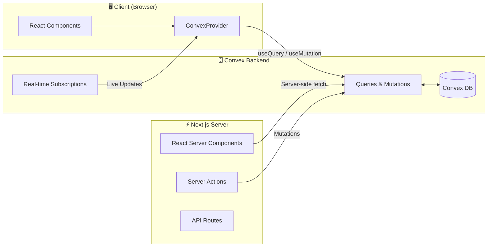

# Portfolio

A modern personal portfolio built with Next.js 14, TypeScript, Tailwind CSS, ShadcnUI, and Convex.

[](https://nextjs.org/)
[](https://www.typescriptlang.org/)
[](https://tailwindcss.com/)
[](https://convex.dev/)

---

## Architecture



---

## Tech Stack

| Layer | Technology | Purpose |
|-------|------------|---------|
| **Frontend** | Next.js 14 (App Router) | React framework with SSR/SSG |
| **Styling** | Tailwind CSS + ShadcnUI | Utility-first CSS + accessible components |
| **Language** | TypeScript | Type safety |
| **Backend** | Convex | Real-time database + serverless functions |
| **Deployment** | Vercel + Convex Cloud | Edge-optimized hosting |

---

## Getting Started

### Prerequisites

- Node.js 18+
- npm or pnpm
- Convex account (free tier available)

### Installation

```bash
# Clone the repository
git clone https://github.com/yourusername/portfolio.git
cd portfolio

# Install dependencies
npm install

# Set up Convex (follow prompts to create a new project)
npx convex dev

# In a new terminal, start the dev server
npm run dev
```

Open [http://localhost:3000](http://localhost:3000) to see the app.

---

## Environment Variables

| Variable | Description | Required |
|----------|-------------|----------|
| `NEXT_PUBLIC_CONVEX_URL` | Convex deployment URL | ✅ |
| `CONVEX_DEPLOYMENT` | Convex deployment name | ✅ |

These are automatically populated when running `npx convex dev`.

---

## Project Structure

```
├── convex/                    # Convex backend
│   ├── _generated/            # Auto-generated types & API
│   ├── schema.ts              # Database schema
│   └── tasks.ts               # Queries & mutations
├── src/
│   ├── app/                   # Next.js App Router
│   │   ├── layout.tsx         # Root layout with providers
│   │   ├── page.tsx           # Home page
│   │   └── globals.css        # Global styles
│   ├── components/
│   │   ├── ui/                # ShadcnUI components
│   │   │   ├── button.tsx
│   │   │   └── card.tsx
│   │   └── convex-provider.tsx
│   └── lib/
│       └── utils.ts           # Utility functions
├── tailwind.config.ts
├── next.config.mjs
└── package.json
```

---

## Scripts

| Command | Description |
|---------|-------------|
| `npm run dev` | Start development server |
| `npm run build` | Build for production |
| `npm run start` | Start production server |
| `npm run lint` | Run ESLint |
| `npx convex dev` | Start Convex dev server |
| `npx convex deploy` | Deploy Convex to production |

---

## Deployment

### Vercel + Convex

1. **Deploy Convex functions:**
   ```bash
   npx convex deploy
   ```

2. **Deploy to Vercel:**
   ```bash
   vercel
   ```

3. **Set environment variables in Vercel:**
   - `NEXT_PUBLIC_CONVEX_URL` → Your production Convex URL

---

## Features

- [ ] **Authentication** — Sign in with OAuth providers
- [ ] **Guestbook** — Real-time guestbook with optimistic UI
- [ ] **Projects** — Showcase portfolio projects
- [ ] **Blog** — MDX-powered blog posts
- [ ] **Analytics** — View counts and visitor stats

---

## License

MIT © [Your Name](https://github.com/yourusername)
