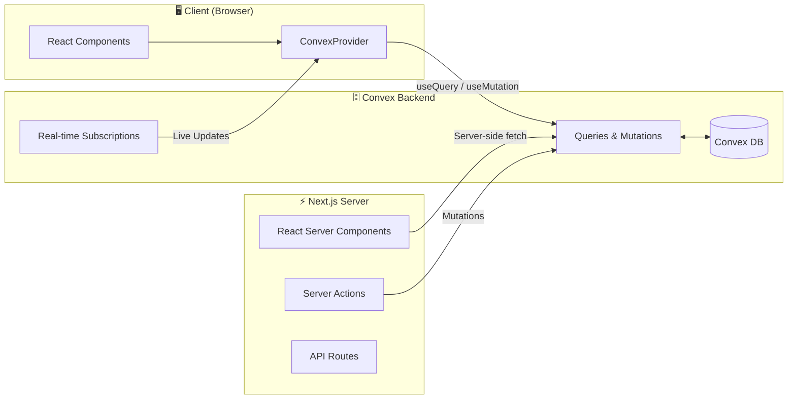

# TODO
1. Highlight secion currently in
2. Expand/fold login(since it is only personal use)

# WIP
Blog component with writing tools(tiptap)

# Portfolio

Currently only serving as portfolio, will expand to a lab/playground later.
Sections to expand next:
 1. Interactive part, where keep tracks of views and likes
 2. Blog section, and for that I need Auth/Token
A modern personal portfolio built with Next.js 14, TypeScript, Tailwind CSS, Framer Motion, and Convex.

[](https://nextjs.org/)
[](https://www.typescriptlang.org/)
[](https://tailwindcss.com/)
[](https://convex.dev/)
[](https://www.framer.com/motion/)

---

## Architecture



---

## Tech Stack

| Layer | Technology | Purpose |
|-------|------------|---------|
| **Frontend** | Next.js 14 (App Router) | React framework with SSR/SSG |
| **Styling** | Tailwind CSS | Utility-first CSS framework |
| **Animation** | Framer Motion | Smooth scroll animations and parallax effects |
| **Smooth Scroll** | Lenis | Smooth scrolling library |
| **Icons** | Lucide React | Icon library |
| **Language** | TypeScript | Type safety |
| **Backend** | Convex | Real-time database + serverless functions |
| **Deployment** | Vercel + Convex Cloud | Edge-optimized hosting |

---

## Getting Started

### Prerequisites

- Node.js 18+
- npm or pnpm
- Convex account (free tier available)

### Installation

```bash
# Clone the repository
git clone https://github.com/yourusername/portfolio.git
cd portfolio

# Install dependencies
npm install

# Set up Convex (follow prompts to create a new project)
npx convex dev

# In a new terminal, start the dev server
npm run dev
```

Open [http://localhost:3000](http://localhost:3000) to see the app.

---

## Environment Variables

| Variable | Description | Required |
|----------|-------------|----------|
| `NEXT_PUBLIC_CONVEX_URL` | Convex deployment URL | ✅ |
| `CONVEX_DEPLOYMENT` | Convex deployment name | ✅ |

These are automatically populated when running `npx convex dev`.

---

## Project Structure

```
├── convex/                    # Convex backend
│   ├── _generated/            # Auto-generated types & API
│   ├── schema.ts              # Database schema
│   ├── links.ts               # Links queries
│   └── projects.ts            # Projects queries
├── src/
│   ├── app/                   # Next.js App Router
│   │   ├── layout.tsx         # Root layout with providers
│   │   ├── page.tsx           # Home page
│   │   └── globals.css        # Global styles
│   ├── components/
│   │   ├── hero/              # Hero section components
│   │   │   └── SmoothScrollHeroSection.tsx
│   │   ├── carousel/          # Carousel components
│   │   │   └── horizontalScrollCarousel/
│   │   │       └── HorizontalScrollCarousel.tsx
│   │   ├── Convex/            # Convex-specific components
│   │   │   └── ConvexImage.tsx
│   │   ├── ui/                # UI components
│   │   │   ├── button.tsx
│   │   │   └── card.tsx
│   │   └── convex-provider.tsx
│   └── lib/
│       └── utils.ts           # Utility functions
├── local/                     # Local data files for import
│   ├── links.jsonl
│   ├── links_prod.jsonl
│   ├── projects.jsonl
│   └── projects_prod.jsonl
├── tailwind.config.ts
├── next.config.mjs
└── package.json
```

---

## Scripts

| Command | Description |
|---------|-------------|
| `npm run dev` | Start development server |
| `npm run build` | Build for production |
| `npm run start` | Start production server |
| `npm run lint` | Run ESLint |
| `npx convex dev` | Start Convex dev server |
| `npx convex deploy` | Deploy Convex to production |
| `npx convex import --table <table> <file> --replace` | Import data from JSONL file |
| `npx convex import --table <table> <file> --replace --prod` | Import data to production |

---

## Deployment

### Vercel + Convex

1. **Deploy Convex functions:**
   ```bash
   npx convex deploy
   ```

2. **Deploy to Vercel:**
   ```bash
   vercel
   ```

3. **Set environment variables in Vercel:**
   - `NEXT_PUBLIC_CONVEX_URL` → Your production Convex URL

---

## Features

- [x] **Parallax Hero Section** — Smooth scrolling hero with parallax effects
- [x] **Project Showcase** — Horizontal scroll carousel displaying portfolio projects
- [x] **Dynamic Content** — Projects and links managed through Convex database
- [x] **Responsive Design** — Mobile-optimized layouts and components
- [x] **Smooth Animations** — Framer Motion powered scroll animations
- [x] **Social Links** — Dynamic links to Resume, LinkedIn, GitHub, and Email

---

## Data Management

### Importing Data

Import projects and links from JSONL files:

```bash
# Import to dev deployment
npx convex import --table projects local/projects.jsonl --replace
npx convex import --table links local/links.jsonl --replace

# Import to production deployment
npx convex import --table projects local/projects_prod.jsonl --replace --prod
npx convex import --table links local/links_prod.jsonl --replace --prod
```

### Schema

The Convex schema includes:
- **projects**: title, description, tags, link, repo, storageId, dark_theme
- **links**: name, url (for Resume, LinkedIn, GitHub, Email)

---

## License

MIT © [Baian Ou](https://github.com/bo23519)
