# Portfolio

A modern personal portfolio built with Next.js 14, TypeScript, Tailwind CSS, Framer Motion, and Convex. Currently serving as a portfolio with plans to expand into a lab/playground.

**Color Scheme**: Inspired by Zenless Zone Zero game

[](https://nextjs.org/)
[](https://www.typescriptlang.org/)
[](https://tailwindcss.com/)
[](https://convex.dev/)
[](https://www.framer.com/motion/)

---

## Architecture

```mermaid
flowchart LR
    subgraph Client["🖥️ Client (Browser)"]
        UI[React Components]
        Provider[ConvexProvider]
    end

    subgraph Server["⚡ Next.js Server"]
        RSC[React Server Components]
        Actions[Server Actions]
        API[API Routes]
    end

    subgraph Backend["🗄️ Convex Backend"]
        Functions[Queries & Mutations]
        DB[(Convex DB)]
        RT[Real-time Subscriptions]
    end

    UI --> Provider
    Provider -->|useQuery / useMutation| Functions
    RSC -->|Server-side fetch| Functions
    Actions -->|Mutations| Functions
    Functions <--> DB
    RT -->|Live Updates| Provider
```



---

## Tech Stack

| Layer | Technology | Purpose |
|-------|------------|---------|
| **Frontend** | Next.js 14 (App Router) | React framework with SSR/SSG |
| **Styling** | Tailwind CSS | Utility-first CSS framework |
| **Animation** | Framer Motion | Smooth scroll animations and parallax effects |
| **Smooth Scroll** | Lenis | Smooth scrolling library |
| **Icons** | Lucide React | Icon library |
| **Language** | TypeScript | Type safety |
| **Backend** | Convex | Real-time database + serverless functions |
| **Deployment** | Vercel + Convex Cloud | Edge-optimized hosting |

---

## Features

### Portfolio
- [x] **Parallax Hero Section** — Smooth scrolling hero with parallax effects
- [x] **Project Showcase** — Horizontal scroll carousel displaying portfolio projects
- [x] **Dynamic Content** — Projects and links managed through Convex database
- [x] **Responsive Design** — Mobile-optimized layouts and components
- [x] **Smooth Animations** — Framer Motion powered scroll animations
- [x] **Social Links** — Dynamic links to Resume, LinkedIn, GitHub, and Email

### Blog System
- [x] **Markdown Editor** — TipTap-based markdown editor with syntax highlighting
- [x] **Blog Posts** — Create, edit, delete blog posts with admin authentication
- [x] **Pagination** — Paginated blog post listings
- [x] **Tag System** — Tag-based organization for blog posts
- [x] **Soft Delete** — Safe deletion with confirmation and recovery support

### Commission Board
- [x] **Commission Management** — Create, edit, delete commissions with status tracking
- [x] **File Uploads** — Image uploads stored in Convex storage
- [x] **Dynamic Grid Layout** — Responsive grid that adapts to screen aspect ratio
- [x] **Status Tracking** — Backlog, Todo, In Progress, Done, Cancelled, Duplicate

### Admin Features
- [x] **Authentication** — Token-based admin authentication
- [x] **Reusable Components** — Shared admin components for consistent UI
- [x] **File Management** — File upload and storage management

---

## Getting Started

### Prerequisites

- **Node.js** 18+ ([download](https://nodejs.org/))
- **npm** (comes with Node.js) or **pnpm**
- **Convex account** ([sign up for free](https://convex.dev/))

### Installation

1. **Clone the repository:**
   ```bash
   git clone https://github.com/yourusername/portfolio.git
   cd portfolio
   ```

2. **Install dependencies:**
   ```bash
   npm install
   ```

3. **Set up Convex:**
   
   Run the Convex dev command. This will:
   - Prompt you to log in or create a Convex account
   - Create a new Convex project (or connect to existing)
   - Generate a `convex.json` configuration file
   - Create `.env.local` with your Convex deployment URL
   - Start the Convex dev server with hot reload
   
   ```bash
   npx convex dev
   ```
   
   Keep this terminal running. The Convex dev server will:
   - Watch for changes in the `convex/` directory
   - Auto-deploy functions and schema changes
   - Stream logs from your Convex functions

4. **Start the Next.js development server:**
   
   In a **new terminal**, run:
   ```bash
   npm run dev
   ```

5. **Open your browser:**
   
   Navigate to [http://localhost:3000](http://localhost:3000) to see the app.

### Optional: Import Sample Data

If you want to populate your database with sample data, you can import from the JSONL files in the `local/` directory:

```bash
# Import to dev deployment
npx convex import --table projects local/projects.jsonl --replace
npx convex import --table links local/links.jsonl --replace
npx convex import --table blogPosts local/blogPosts.jsonl --replace
npx convex import --table commissions local/commissions.jsonl --replace
```

---

## Environment Variables

The following environment variables are automatically created in `.env.local` when you run `npx convex dev`:

| Variable | Description | Required | Auto-generated |
|----------|-------------|----------|----------------|
| `NEXT_PUBLIC_CONVEX_URL` | Convex deployment URL | ✅ | Yes |
| `CONVEX_DEPLOYMENT` | Convex deployment name | ✅ | Yes |

**Note:** The `.env.local` file is automatically created and should not be committed to git. Make sure it's listed in your `.gitignore`.

---

## Project Structure

```
├── convex/                    # Convex backend
│   ├── _generated/            # Auto-generated types & API
│   ├── content/               # Content-related queries & mutations
│   │   ├── blogPosts.ts       # Blog post queries & mutations
│   │   ├── commissions.ts     # Commission queries & mutations
│   │   └── projects.ts        # Project queries & mutations
│   ├── storage/               # File storage functions
│   │   ├── assets.ts          # Asset management
│   │   └── files.ts           # File upload & retrieval
│   ├── system/                # System & utility functions
│   │   ├── auth.ts            # Authentication functions
│   │   ├── cleanup.ts         # Data cleanup tasks
│   │   ├── links.ts           # Links queries
│   │   ├── stats.ts           # Statistics queries
│   │   └── tags.ts            # Tag management
│   ├── crons.ts               # Scheduled cron jobs
│   ├── schema.ts              # Database schema definitions
│   └── tsconfig.json          # TypeScript config for Convex
├── src/
│   ├── app/                   # Next.js App Router
│   │   ├── blog/              # Blog pages
│   │   │   ├── [id]/          # Individual blog post pages
│   │   │   │   ├── delete/    # Delete confirmation page
│   │   │   │   ├── edit/      # Edit blog post page
│   │   │   │   └── page.tsx   # Blog post detail page
│   │   │   ├── create/        # Create blog post page
│   │   │   └── page.tsx       # Blog listing page
│   │   ├── commission/        # Commission pages
│   │   │   ├── [id]/          # Individual commission pages
│   │   │   │   ├── delete/    # Delete confirmation page
│   │   │   │   ├── edit/      # Edit commission page
│   │   │   │   └── page.tsx   # Commission detail page
│   │   │   ├── create/        # Create commission page
│   │   │   └── page.tsx       # Commission listing page
│   │   ├── project/           # Project pages
│   │   │   ├── [id]/          # Individual project pages
│   │   │   │   └── edit/      # Edit project page
│   │   │   └── create/        # Create project page
│   │   ├── layout.tsx         # Root layout with providers
│   │   ├── page.tsx           # Home page
│   │   └── globals.css        # Global styles
│   ├── components/
│   │   ├── admin/             # Admin components
│   │   │   ├── AssetUploadModal.tsx
│   │   │   ├── DeleteConfirmationPage.tsx
│   │   │   ├── FileUpload.tsx
│   │   │   ├── LoadingState.tsx
│   │   │   └── PageHeader.tsx
│   │   ├── blog/              # Blog components
│   │   │   └── Pagination.tsx
│   │   ├── carousel/          # Carousel components
│   │   │   └── horizontalScrollCarousel/
│   │   │       └── HorizontalScrollCarousel.tsx
│   │   ├── commission/        # Commission components
│   │   │   └── CommissionDetailModal.tsx
│   │   ├── convex/            # Convex-specific components
│   │   │   └── ConvexImage.tsx
│   │   ├── editor/            # Editor components
│   │   │   └── TipTapEditor.tsx
│   │   ├── hero/              # Hero section components
│   │   │   └── SmoothScrollHeroSection.tsx
│   │   ├── likeButton/        # Like button component
│   │   │   └── LikeButton.tsx
│   │   ├── navigation/        # Navigation components
│   │   │   └── NavBar.tsx
│   │   ├── tags/              # Tag components
│   │   │   ├── TagDisplay.tsx
│   │   │   └── TagSelector.tsx
│   │   ├── ui/                # UI components (shadcn/ui)
│   │   │   ├── button.tsx
│   │   │   └── Input.tsx
│   │   └── convex-provider.tsx # Convex client provider
│   ├── hooks/                 # Custom React hooks
│   │   ├── useAdminAuth.ts    # Admin authentication hook
│   │   └── useFileUpload.ts   # File upload hook
│   └── lib/                   # Utility functions
│       ├── blog-utils.ts      # Blog-related utilities
│       ├── colors.ts          # Color constants
│       ├── styles.ts          # Style utilities
│       └── utils.ts           # General utilities
├── local/                     # Local data files for import
│   ├── auth.jsonl
│   ├── blogPosts.jsonl
│   ├── commissions.jsonl
│   ├── links.jsonl
│   ├── links_prod.jsonl
│   ├── projects.jsonl
│   └── projects_prod.jsonl
├── public/                    # Static assets
├── components.json            # shadcn/ui components config
├── tailwind.config.ts         # Tailwind CSS configuration
├── postcss.config.mjs         # PostCSS configuration
├── next.config.mjs            # Next.js configuration
├── tsconfig.json              # TypeScript configuration
└── package.json               # Dependencies & scripts
```

---

## Scripts

| Command | Description |
|---------|-------------|
| `npm run dev` | Start development server |
| `npm run build` | Build for production |
| `npm run start` | Start production server |
| `npm run lint` | Run ESLint |
| `npx convex dev` | Start Convex dev server |
| `npx convex deploy` | Deploy Convex to production |
| `npx convex import --table <table> <file> --replace` | Import data from JSONL file |
| `npx convex import --table <table> <file> --replace --prod` | Import data to production |

---

## Deployment

### Vercel + Convex

1. **Deploy Convex functions:**
   ```bash
   npx convex deploy
   ```

2. **Deploy to Vercel:**
   ```bash
   vercel
   ```

3. **Set environment variables in Vercel:**
   - `NEXT_PUBLIC_CONVEX_URL` → Your production Convex URL

---

## Data Management

### Importing Data

Import projects, links, blog posts, and commissions from JSONL files:

```bash
# Import to dev deployment
npx convex import --table projects local/projects.jsonl --replace
npx convex import --table links local/links.jsonl --replace
npx convex import --table blogPosts local/blogPosts.jsonl --replace
npx convex import --table commissions local/commissions.jsonl --replace

# Import to production deployment
npx convex import --table projects local/projects_prod.jsonl --replace --prod
npx convex import --table links local/links_prod.jsonl --replace --prod
```

### Schema

The Convex schema includes:
- **projects**: title, description, tags, link, repo, storageId, dark_theme
- **links**: name, url, icon, file
- **blogPosts**: title, content, tags, deletedAt
- **commissions**: title, description, tags, cover, status, deletedAt
- **files**: name, url, type, size
- **stats**: likes, views

---

## Code Organization

### Reusable Components

The project uses a component-based architecture with reusable admin components:

- **`useAdminAuth`** - Hook for admin authentication checks
- **`useFileUpload`** - Hook for file uploads to Convex storage
- **`DeleteConfirmationPage`** - Reusable delete confirmation page
- **`FileUpload`** - File upload component with preview
- **`PageHeader`** - Consistent page headers
- **`LoadingState`** - Loading state component

### Design System

- **Colors**: ZZZ-inspired color scheme with CSS variables
- **Typography**: Custom prose styles for markdown content
- **Components**: Consistent button styles and form inputs
- **Animations**: Framer Motion for smooth transitions

---

## License

MIT © [Baian Ou](https://github.com/bo23519)
